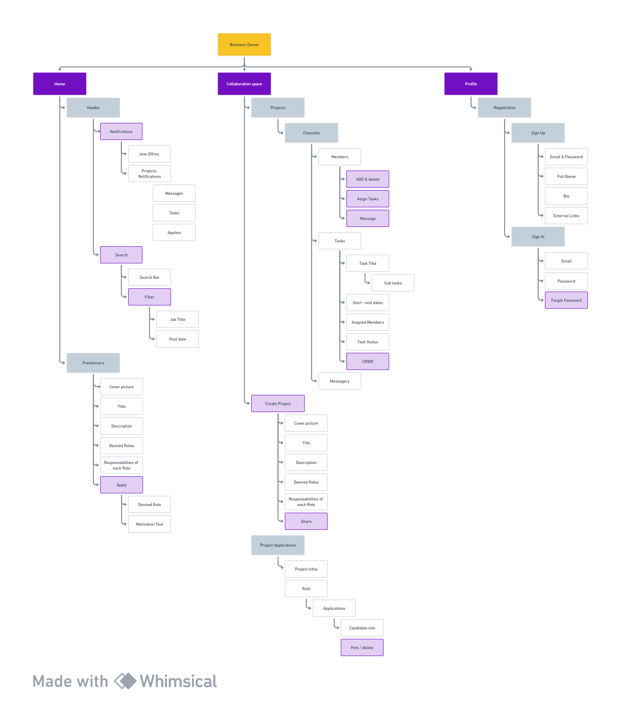
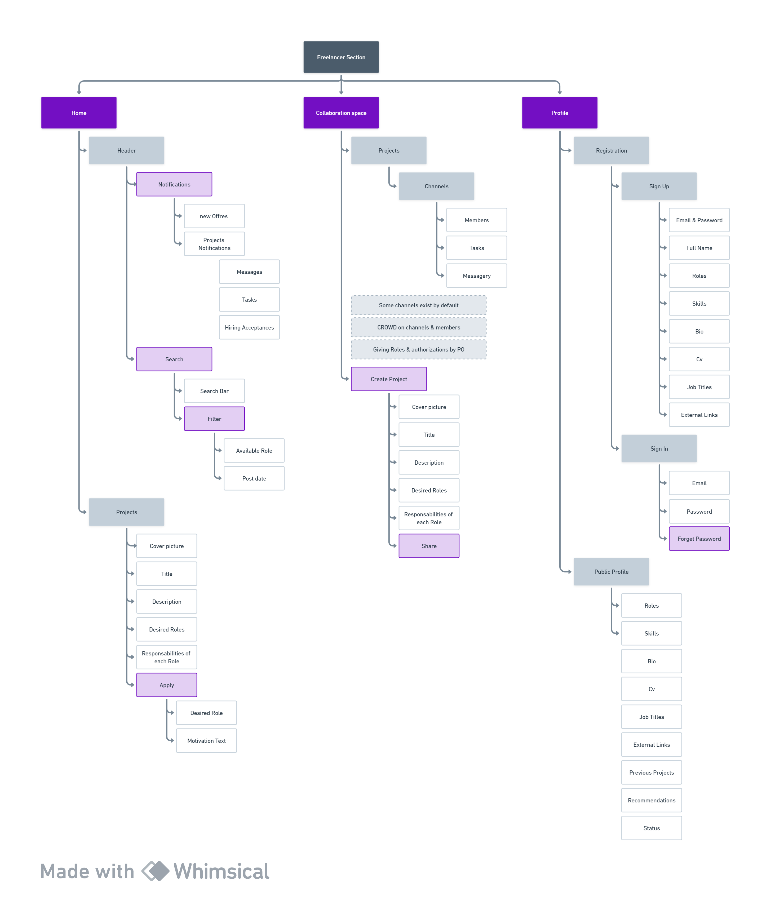

Code Documentation for the project

## Installation
1. Clone the repository
2. Install the dependencies using npm install
3. Run the project using npm run dev
 
## What is this project about?
This project is a web application that allows business owners to post jobs and freelancers to apply for jobs. this job main funcionalities is to make collaboration between business owners and freelancers easier.
and also to make their data secure and not be in other countries hands, with charming UI and UX., and smooth user experience., facilitating the process of finding the right person for the job. and daily tasks

## Backend-Repo
- [Backend-Repo](https://github.com/1FarZ1/innoByte)

## Technologies used
- React
- Redux
- Redux-thunk
- React-router-dom
- Axios
- Material-UI
- React-hook-form
- React-toastify
- React-loader-spinner
- React-icons
- React-google-login
- shadcn
- tailwindcss
- nestjs
- mongoose
- pwt
- socket io
- socket io client
- node mailer
- swagger
- class-validator
- class-transformer
- gateway

## Features
- User can sign up as a business owner or a freelancer
- User can sign in as a business owner or a freelancer
- User can post a job as a business owner
- User can apply for a job as a freelancer
- User can see all the jobs as a freelancer
- User can see all the applicants as a business owner
- User can see all the jobs he posted as a business owner
- members can chat with each other in a collaborative space smoothly
- project owner can see all the members in the project
- project owner can see all the projects he posted
- project owner can assign tasks to members
- project owner can see all the tasks he assigned
- project owner can see all the tasks he assigned to a specific member
- each member has its associated channel
- each member can see all the tasks assigned to him
- each freelancer have a profile that showcase his skills and experience
- each business owner have a profile that showcase his company and his projects
- each member can see all the projects he is in
## Bussiness Owner Flow Diagram

## Freelancer Flow Diagram

